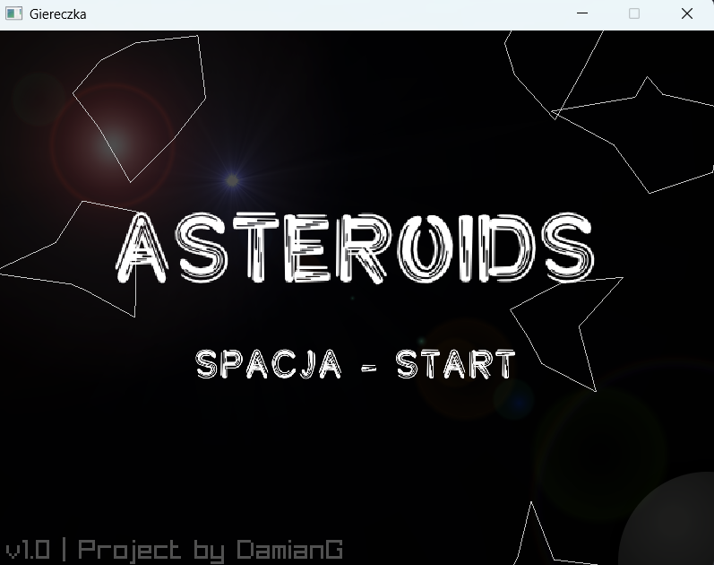
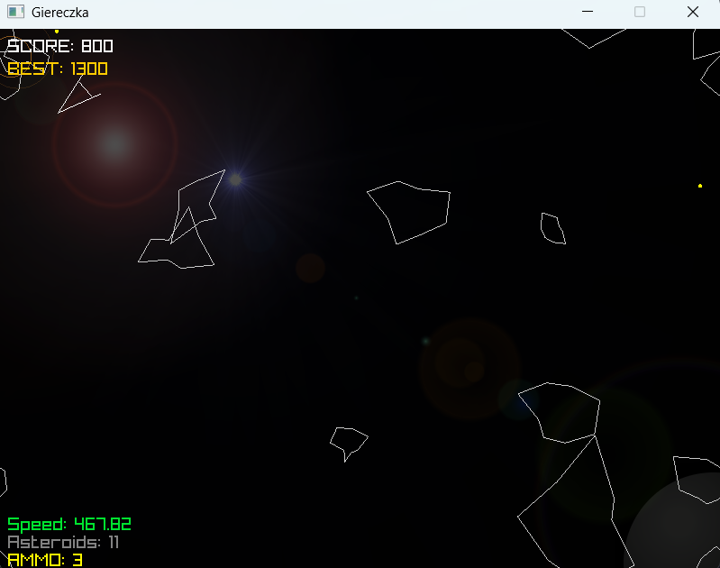
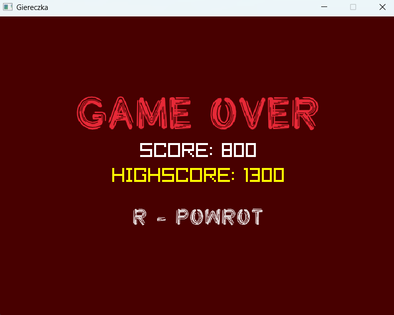

# Laboratoria 08




## Instrukcja Obsługi

### 1. Jak uruchomić program?
Głównym plikiem wejściowym jest **`main.py`**. Aby odpalić grę, upewnij się, że masz zainstalowaną bibliotekę pyray i pliki (`main.py`, `ship.py`, `asteroid.py`, `utils.py`, `config.py`, `explosion.py`) znajdują się w tym samym folderze.
```bash
python main.py
```

### 2. Sterowanie
Program obsługuje dwa schematy sterowania (Strzałki oraz WSAD):

•	**W / ↑**: 
Jazda w przód.

•	**A / D / ←/→**: 
Obracanie statkiem wokół własnej osi.

•	**Z**: 
Hamulec awaryjny, redukuje prędkość statku i aktywuje czerwone światła stopu na tylnych skrzydłach.

•	**ESC**: 
Wyjście z programu.

## 3. Struktura plików
•	`main.py`: 
inicjalizacja, pętla główna, obsługa rysowania

•	`ship.py`: 
logika ruchu, obrotu i rysowania gracza.

•	`asteroid.py`: 
generowanie kształtów i ruch skał.

•	`utils.py`: 
funkcja ghost_positions, check_collision_circles, cleanup_dead i stałe pomocnicze.

•	`config.py`: 
wszystkie liczby, prędkości i ustawienia.

•	`bullet.py`: 
obsługa pocisków.

•	`explosion.py`: 
system cząsteczek animujących wybuchy po kolizji.

