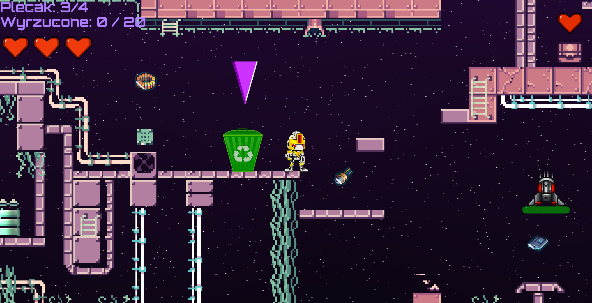

# Galaxy Cleaner 🚀

> **Galaxy Cleaner** to dynamiczna gra zręcznościowa 2D osadzona w przestrzeni kosmicznej. Gracz wciela się w postać robota-sprzątacza, którego celem jest oczyszczenie planety z zalegających odpadów. Rozgrywka polega na zbieraniu śmieci i dostarczaniu ich do wyznaczonego kosza. Na drodze gracza stoją przeciwnicy oraz pułapki terenowe. Gra oferuje trzy poziomy trudności (**łatwy**, **średni**, **trudny**), które różnią się intensywnością spawnienia obiektów oraz liczbą przeciwników.

---

## Jak się gra?
* **Cel:** Posprzątaj planetę, zbierając śmieci i wyrzucając je do kosza. Uważaj na wrogów i pułapki!
* **Plecak:** Masz limit 4 śmieci w plecaku. Musisz wracać do kosza, aby go opróżnić.
* **Życia:** Masz 3 życia. Możesz je odzyskać, zbierając apteczki.

### Sterowanie:
| Klawisz / Akcja | Działanie |
| :--- | :--- |
| `← / →` | Ruch postaci |
| `↑` | Skok |
| `E` | Wyrzucenie śmieci do kosza |
| `Ctrl Lewy` | Ślizg |
| `Spacja` | Strzelanie do wrogów |

---

## Silnik i uruchomienie
* **Silnik:** Godot 4.x
* **Język:** GDScript

### Jak uruchomić?
1. Pobierz repozytorium projektu.
2. Otwórz projekt w edytorze Godot 4.x.
3. Naciśnij F5 lub przycisk Play, aby uruchomić grę.

---

## Własne mechanizmy
Projekt zawiera autorskie rozwiązania, które wykraczają poza standardowe założenia:

* **Dynamiczne Spawnery:** Śmieci, wrogowie i apteczki są generowane proceduralnie. Poziom trudności skaluje ich liczbę w czasie rzeczywistym.
* **Logistyka Odpadów:** System plecaka (max 4 sztuki) wymusza planowanie trasy między strefami zanieczyszczeń a punktem zrzutu.
* **FSM (Maszyna Stanów):** Rozbudowana logika gracza oraz wrogów (AI z raycastingiem) zapewnia płynne przejścia między animacjami i reakcjami na otoczenie.

---

## System shaderów
Gra wykorzystuje zaawansowane efekty wizualne stworzone w języku shaderów:
1. **Proceduralne tło:** Shader kosmosu z gwiazdami i mgławicami generowany w czasie rzeczywistym.
2. **Efekty Vertex:** Organiczne bujanie trawy i pulsowanie apteczek (dodatkowych żyć).
3. **Custom Bloom:** Autorski algorytm poświaty dla obiektów typu "śmieć".
4. **Dystorsja:** Shader bagna zniekształcający obraz w niebezpiecznych strefach.

---

## Wykorzystane zasoby
| Typ | Źródło |
| :--- | :--- |
| **Grafiki** | [itch.io](https://itch.io) |
| **Dźwięki / BGM** | [Pixabay](https://pixabay.com) |

---

## Znane bugi
* **Kolizja podczas ślizgu:** Podczas gdy gracz aktywuje ślizg bezpośrednio przy kolizji z kafelkiem, może dojść do zablokowania mechaniki ślizgu.

---

## Czy projekt jest klonem?
**Nie, jest to projekt w 100% autorski.** Gra nie jest oparta na żadnym konkretnym tutorialu ani gotowym projekcie.
