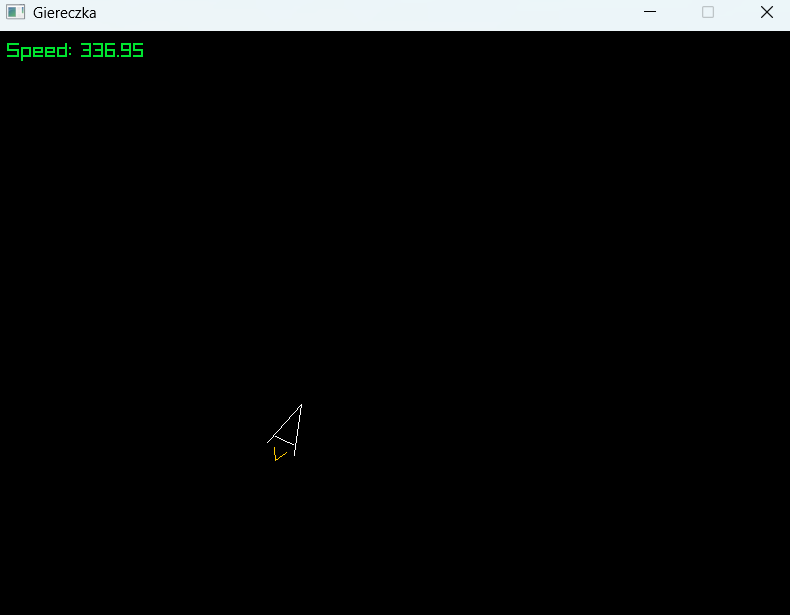

# Laboratoria 05


## Instrukcja Obsługi

### 1. Jak uruchomić program?
Głównym plikiem wejściowym jest **`main.py`**. Aby odpalić grę, upewnij się, że masz zainstalowaną bibliotekę pyray i oba pliki (`main.py` oraz `ship.py`) znajdują się w tym samym folderze.
```bash
python main.py
```

### 2. Sterowanie
Program obsługuje dwa schematy sterowania (Strzałki oraz WSAD):

•	W / ↑: 
Jazda w przód.

•	A / D / ←/→: 
Obracanie statkiem wokół własnej osi.

•	Z: 
Hamulec awaryjny, redukuje prędkość statku i aktywuje czerwone światła stopu na tylnych skrzydłach.

•	ESC: 
Wyjście z programu.

## 3. Struktura plików
•	`main.py`: 
Pętla główna gry, obsługa okna i renderowanie UI.

•	`ship.py`: 
Logika klasy Ship, macierz rotacji, fizyka ruchu oraz definicja kształtu statku.

